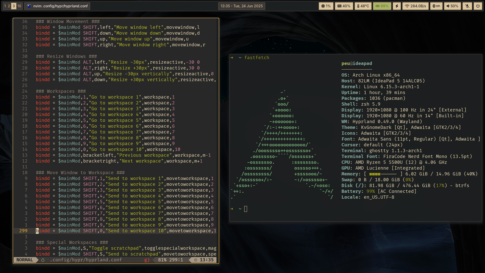
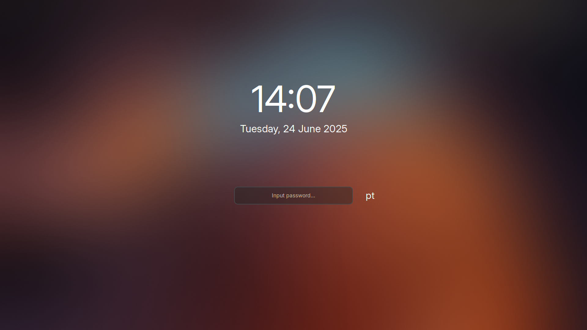

# 🏠 Dotfiles

A clean and minimal [`Arch Linux`](https://archlinux.org/) setup, powered by [**`Hyprland`**](https://hypr.land/). It's build for software development, focusing on simplicity, speed and a **distraction-free** workflow.

> [!WARNING]
> These dotfiles are tailored specifically for my system and preferences. Use them for inspiration and reference only. Make sure you understand what you're installing before applying them to your system.

## 📦 Software

### Core System

- **Window Manager:** [`Hyprland`](https://hypr.land/)
- **Status Bar:** [`Waybar`](https://github.com/Alexays/Waybar/)
- **Wallpaper Manager:** [`swww`](https://github.com/LGFae/swww/) + [`Waypaper`](https://anufrievroman.gitbook.io/waypaper/)
- **Idle Daemon:** [`hypridle`](https://wiki.hypr.land/Hypr-Ecosystem/hypridle/)
- **Screen Locker:** [`hyprlock`](https://wiki.hypr.land/Hypr-Ecosystem/hyprlock/)
- **Logout Menu:** [`wlogout`](https://github.com/ArtsyMacaw/wlogout/)
- **Notification Daemon:** [`Dunst`](https://dunst-project.org/)
- **OSD:** [`SwayOSD`](https://github.com/ErikReider/SwayOSD/)
- **Display Manager**: [`greetd`](https://sr.ht/~kennylevinsen/greetd/) + [`tuigreet`](https://github.com/apognu/tuigreet/)
- **Clipboard Manager:** [`wl-clipboard`](https://github.com/bugaevc/wl-clipboard/) + [`cliphist`](https://github.com/sentriz/cliphist/)

### Terminal & Shell

- **Terminal Emulator:** [`Ghostty`](https://ghostty.org/)
- **Shell:** [`Zsh`](https://www.zsh.org/)
  - **Plugin Manager:** [`oh-my-zsh`](https://ohmyz.sh/)
  - **Plugins:** [`zsh-autosuggestions`](https://github.com/zsh-users/zsh-autosuggestions/), [`zsh-syntax-highlighting`](https://github.com/zsh-users/zsh-syntax-highlighting/)
- **Text Editors:** [`Vim`](https://www.vim.org/), [`Neovim`](https://neovim.io/), [`Nano`](https://www.nano-editor.org/)
- **Terminal Multiplexer:** [`tmux`](https://github.com/tmux/tmux/)
- **System Information:** [`fastfetch`](https://github.com/fastfetch-cli/fastfetch/)

### Applications

- **Application Launcher:** [`Fuzzel`](https://codeberg.org/dnkl/fuzzel/)
- **Code Editor:** [`VS Code`](https://code.visualstudio.com/), [`Zed`](https://zed.dev/)
- **Web Browser:** [`Firefox`](https://www.mozilla.org/firefox/)

### Utilities

- **Screenshot Tool:** [`Grim`](https://gitlab.freedesktop.org/emersion/grim/) + [`Slurp`](https://github.com/emersion/slurp/) + [`swappy`](https://github.com/jtheoof/swappy/)
- **Monitor Control:** [`ddcutil`](https://www.ddcutil.com/)
- **Dotfiles Manager:** [`chezmoi`](https://www.chezmoi.io/)

## 🎨 Color Palette

The setup uses the **Gruvbox Dark** color scheme consistently across all applications and configurations.

### Background Colors

- **bg0_hard**: `#1d2021` 
- **bg0**: `#282828` 
- **bg1**: `#3c3836` 
- **bg2**: `#504945` 
- **bg3**: `#665c54` 
- **gray**: `#928374` 

### Foreground Colors

- **fg0**: `#fbf1c7` 
- **fg1**: `#ebdbb2` 
- **fg2**: `#a89984` 
- **white**: `#ffffff` 

### Neutral Colors

- **neutral**: `#c7ab7a` 
- **light_neutral**: `#ddc7a1` 
- **medium_neutral**: `#d4be98` 

### Accent Colors

- **red**: `#cc241d` 
- **yellow**: `#d79921` 
- **light_green**: `#a9b665` 
- **dark_green**: `#6c782e` 
- **blue**: `#83a598` 
- **purple**: `#d3869b` 
- **orange**: `#e78a4e` 

## 📄 License

Copyright (c) Pedro Castro.\
Released under the MIT License. See [LICENSE](LICENSE) for details.
